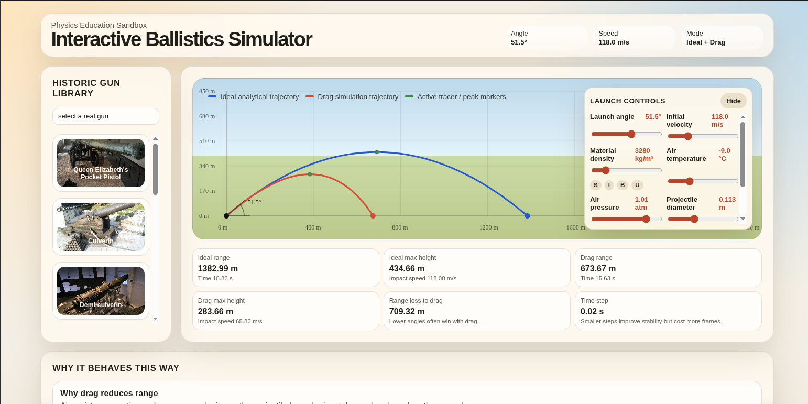

# 🚀 Ballistic Simulation with Dynamic Air Resistance

Physics-based projectile motion simulator with **non-constant aerodynamic drag**, computed dynamically from Reynolds number and atmospheric conditions.

---

## ⚡ TL;DR

This project implements a ballistic simulation engine where:

- drag coefficient is **not constant**
- air density is derived from **temperature and pressure**
- dynamic viscosity is computed using **Sutherland’s law**
- flow regime is determined via **Reynolds number**
- velocity is solved using an **iterative method**

👉 Result: significantly more realistic trajectories compared to simplified models.

---

## 📊 Example: Ideal vs Realistic Trajectory



Comparison between:
- ideal trajectory (no air resistance)
- realistic trajectory with drag computed from Reynolds number

The realistic model shows reduced range and a different trajectory shape due to velocity-dependent drag.

---

## 🌐 Live Demo

👉 https://funmechanics.net:8443/

---

## 🧠 Why this is different

Most projectile simulations use a simplified drag model:

```python
Fd = k * v**2
```

where the drag coefficient is constant.

This project instead computes drag dynamically based on physical principles:

- air density from **ideal gas law**
- dynamic viscosity from **Sutherland’s law**
- drag coefficient from **Reynolds number**
- nonlinear coupling between velocity and drag resolved iteratively

👉 Drag changes continuously with velocity and environment.

---

## 🔬 Physics Model

### Air Density

rho = p / (R * T)

### Dynamic Viscosity (Sutherland’s Law)

mu(T) = mu0 * (T / T0)^(3/2) * (T0 + S) / (T + S)

### Reynolds Number

Re = rho * v * d / mu

### Drag Coefficient (Sphere)

- Re < 0.1 → Cd = 24 / Re  
- 0.1 ≤ Re < 1000 → Cd = 24 / Re * (1 + 0.15 * Re^0.687)  
- Re ≥ 1000 → Cd = 0.44  

### Drag Force

Fd = 0.5 * rho * v^2 * Cd * A

---

## ⚙️ Key Features

- Reynolds-number-based drag model  
- Atmospheric model (temperature + pressure → density, viscosity)  
- Automatic transition between flow regimes  
- Iterative solver for velocity-dependent drag  
- Support for low-density (near-vacuum) conditions  
- Interactive visualization  

---

## 🧩 Input Parameters

- temperature (°C)
- pressure (atm)
- projectile diameter (m)
- projectile material density (kg/m³)
- initial velocity (m/s)

---

## 📈 Output

- velocity vector  
- trajectory  
- Reynolds number  
- drag coefficient  
- air density  

---

## 🧪 Usage

```bash
python main.py
```

---

## ⚠️ Assumptions

- spherical projectile  
- subsonic regime  
- no wind, spin, or turbulence  
- ideal gas approximation  

---

## 📌 Key Insight

Drag is not constant — it depends on Reynolds number, which in turn depends on velocity and environmental conditions.  
This creates a nonlinear system that requires iterative solving and leads to behavior not captured by simplified models.

---

## 🚀 Future Work

- altitude-dependent atmospheric model  
- Mach number corrections  
- non-spherical projectiles  
- wind and turbulence  
- higher-order numerical integration (RK4)  

---

## 👤 Author

Igor Nikitin
